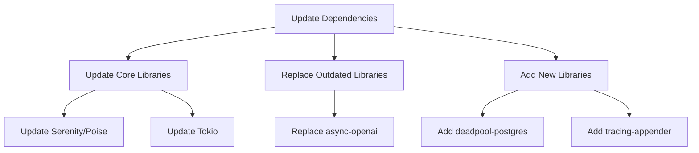
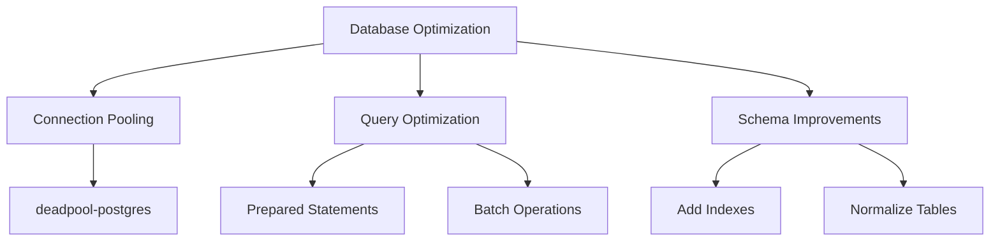
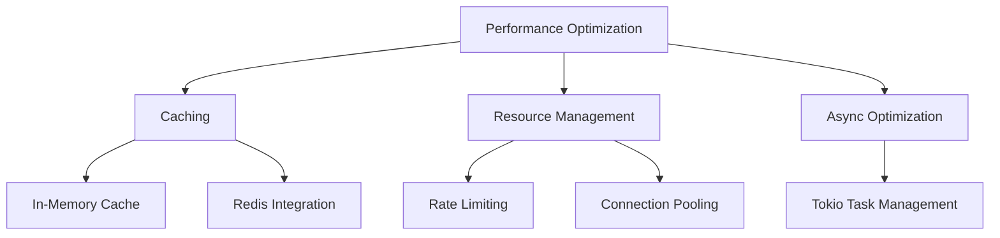

# Detailed Implementation Plan

## Phase 1: Dependency Optimization and Project Structure

### 1.1 Update Dependencies and Cargo.toml

**Tasks:**
1. Update Cargo.toml with latest versions of core dependencies
   - Update tokio to latest stable
   - Update serenity and poise to latest compatible versions
   - Update postgres-related crates

2. Add new dependencies:
   - `deadpool-postgres` for connection pooling
   - `tracing-appender` for log rotation
   - `dotenv` for environment variable management

3. Remove or replace unnecessary dependencies:
   - Consider replacing `async-openai` with a lighter alternative
   - Consolidate HTTP clients (standardize on reqwest)

**Expected Outcome:**
- Modernized dependency tree
- Reduced dependency footprint
- Better performance and security

### 1.2 Reorganize Project Structure

**Tasks:**
1. Reorganize command modules:
   - Create subdirectories in `src/commands/` for functional groups:
     - `src/commands/admin/` (warn, purge, etc.)
     - `src/commands/fun/` (random images, blame, etc.)
     - `src/commands/utility/` (weather, reminders, etc.)
     - `src/commands/availability/` (unavailable commands)

2. Create service modules:
   - `src/services/` directory for business logic
   - Move database operations from commands to services
   - Create service modules for external API calls

3. Improve configuration management:
   - Create `src/config/` directory
   - Split configuration into logical components
   - Add environment-specific configurations

**Expected Outcome:**
- More maintainable code structure
- Better separation of concerns
- Easier navigation of codebase

## Phase 2: Database Optimization

### 2.1 Implement Connection Pooling

**Tasks:**
1. Replace direct postgres connection with connection pool:
   - Implement `deadpool-postgres` for connection pooling
   - Configure pool size based on expected load
   - Add health checks for database connections

2. Update Database struct to use connection pool:
   - Modify `Database::connect()` to create and return a pool
   - Update all database methods to acquire connections from pool
   - Add proper error handling for connection failures

**Expected Outcome:**
- Better handling of concurrent database operations
- Improved resilience to connection issues
- More efficient resource utilization

### 2.2 Optimize Database Queries and Schema

**Tasks:**
1. Review and optimize existing queries:
   - Add prepared statements for frequently used queries
   - Implement batch operations where appropriate
   - Add query timeouts

2. Improve database schema:
   - Review and add indexes for frequently queried fields
   - Normalize tables where appropriate
   - Add constraints for data integrity

3. Add database migrations system:
   - Implement proper versioning for migrations
   - Create migration scripts for schema changes
   - Add documentation for migration process

**Expected Outcome:**
- Faster query execution
- Reduced database load
- Better data integrity

## Phase 3: Error Handling and Logging

### 3.1 Improve Error Handling

**Tasks:**
1. Enhance error types:
   - Add more specific error variants to `Error` enum
   - Implement proper context for errors
   - Add user-friendly error messages

2. Implement consistent error handling:
   - Add recovery mechanisms for transient failures
   - Implement retry logic for external API calls
   - Add circuit breakers for failing dependencies

**Expected Outcome:**
- More robust error handling
- Better user experience during failures
- Easier debugging

### 3.2 Enhance Logging System

**Tasks:**
1. Implement structured logging:
   - Configure `tracing` with appropriate levels
   - Add context to log entries (guild ID, user ID, etc.)
   - Implement log filtering

2. Add log rotation:
   - Configure `tracing-appender` for log rotation
   - Set appropriate log retention policies
   - Add compression for older logs

3. Add monitoring hooks:
   - Log important events for monitoring
   - Add performance metrics
   - Implement health check endpoints

**Expected Outcome:**
- Better visibility into application behavior
- Easier troubleshooting
- Reduced disk usage from logs

## Phase 4: Performance Optimizations

### 4.1 Implement Caching

**Tasks:**
1. Add in-memory caching:
   - Implement LRU cache for frequently accessed data
   - Cache guild configurations, user levels, etc.
   - Add proper cache invalidation

2. Optimize external API calls:
   - Add caching for API responses
   - Implement rate limiting for API calls
   - Add fallback mechanisms for API failures

**Expected Outcome:**
- Reduced database load
- Faster response times
- Better handling of external API limitations

### 4.2 Optimize Async Patterns

**Tasks:**
1. Review and optimize async code:
   - Ensure proper use of `tokio::spawn`
   - Optimize task scheduling
   - Implement proper cancellation

2. Add resource management:
   - Implement timeouts for long-running operations
   - Add backpressure mechanisms
   - Optimize memory usage

**Expected Outcome:**
- Better resource utilization
- Improved concurrency
- Reduced memory footprint

## Phase 5: Containerization and Deployment

### 5.1 Create Docker Configuration

**Tasks:**
1. Create Dockerfile:
   - Use multi-stage build for smaller image
   - Configure proper base image (debian-slim or alpine)
   - Optimize for size and security

2. Create docker-compose.yml:
   - Include PostgreSQL service
   - Configure volumes for persistence
   - Set up networking

**Expected Outcome:**
- Consistent deployment environment
- Easier deployment process
- Better isolation

### 5.2 Configure for Ubuntu Deployment

**Tasks:**
1. Create systemd service file:
   - Configure proper user and permissions
   - Set restart policies
   - Configure resource limits

2. Create deployment scripts:
   - Add scripts for database setup
   - Create backup and restore scripts
   - Add monitoring configuration

3. Document deployment process:
   - Create step-by-step deployment guide
   - Document configuration options
   - Add troubleshooting information

**Expected Outcome:**
- Reliable deployment on Ubuntu
- Easy maintenance procedures
- Clear documentation for operations

## Phase 6: Security Enhancements

### 6.1 Improve Configuration Security

**Tasks:**
1. Move sensitive configuration to environment variables:
   - API keys
   - Database credentials
   - Bot token

2. Implement proper permission checks:
   - Add role-based command restrictions
   - Implement command cooldowns
   - Add audit logging for sensitive operations

**Expected Outcome:**
- Better security posture
- Reduced risk of credential leakage
- Proper access controls

## Implementation Timeline

### Week 1-2: Foundation Work
- Update dependencies
- Reorganize project structure
- Implement connection pooling

### Week 3-4: Core Improvements
- Optimize database queries and schema
- Enhance error handling and logging
- Implement basic caching

### Week 5-6: Performance and Deployment
- Complete performance optimizations
- Create Docker configuration
- Configure for Ubuntu deployment

### Week 7-8: Security and Finalization
- Implement security enhancements
- Conduct testing
- Document changes and deployment process

## Prioritized Implementation Order

1. **High Priority (Immediate Impact)**
   - Update dependencies
   - Implement connection pooling
   - Enhance error handling and logging

2. **Medium Priority (Significant Improvements)**
   - Reorganize project structure
   - Optimize database queries
   - Implement caching

3. **Lower Priority (Long-term Benefits)**
   - Containerization
   - Advanced performance optimizations
   - Security enhancements
